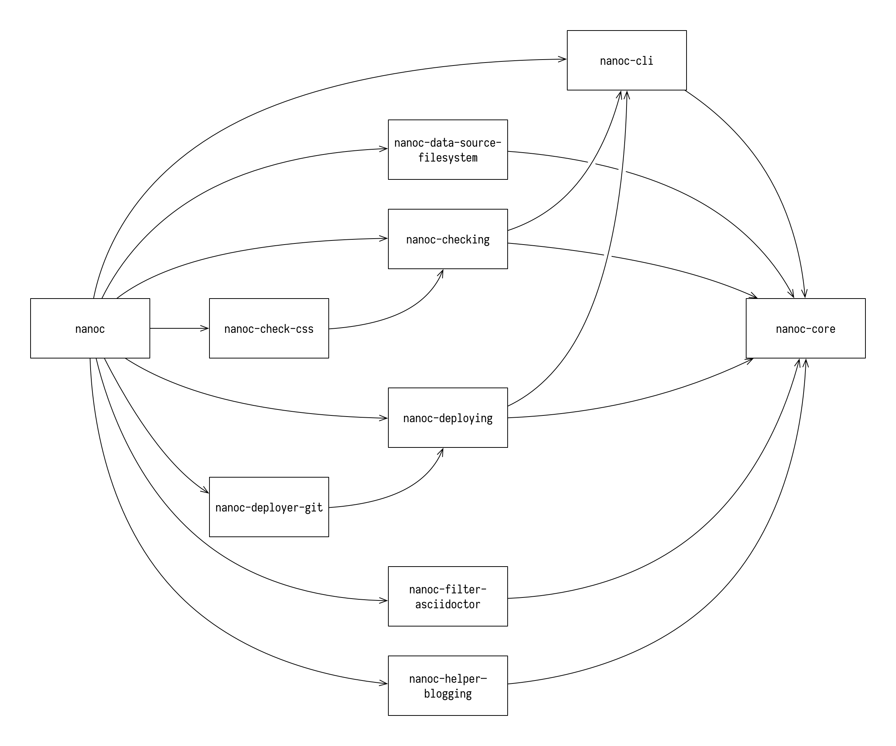

# Modularize

Split Nanoc into multiple gems

## Motivation

At the moment of writing, Nanoc is a monolithic application that includes not only the core logic, but also most filters, most helpers, the implementation for the Ruby-based rule DSL, the command-line interface, deployment support, checking support, and more.

This creates several drawbacks:

- **Tests are slow.** All tests live together, and when making a change, it’s not easy to only run the tests for that specific change. For example, a change in the deployer requires also running the core tests, and vice versa.

- **Dependencies cannot be declared explicitly.** Nanoc comes with a handful of filters, most of which require a specific gem to be installed. Nanoc cannot explicitly depend on those gems, because these gems are optional (not everyone will use them), and might not be installable on all platforms (e.g. not on JRuby or Windows). These gems have to be manually installed instead, and Nanoc cannot require these gems to be a specific version.

- **Nanoc is unsafe by design, as it executes user-supplied Ruby code in multiple places.** This makes it impossible to use Nanoc in some situations, e.g. on hosted platforms, even though conceptually, there is nothing preventing Nanoc to be safe. For this to work, however, it should be possible to forcibly not load the ERB filter, code snippets, and have an alternative to the Ruby-based rule DSL.

Furthermore, by splitting Nanoc, the overall architecture becomes more clear, and the individual modules can be iterated on faster.

## Detailed design

The end result will be that Nanoc is split up into the following gems:

* `nanoc-core` contains Nanoc’s core logic
* `nanoc-cli`
* Data sources
  * `nanoc-data-source-filesystem`
* Checking support
  * `nanoc-checking`
  * `nanoc-check-css`
  * `nanoc-check-external-links`
  * `nanoc-check-html`
  * `nanoc-check-internal-links`
  * `nanoc-check-mixed-content`
  * `nanoc-check-stale`
* Deploying support
  * `nanoc-deploying`
  * `nanoc-deployer-fog`
  * `nanoc-deployer-git`
  * `nanoc-deployer-rsync`
* Filters
  * `nanoc-filter-asciidoc`
  * `nanoc-filter-asciidoctor`
  * `nanoc-filter-bluecloth`
  * …
* Helpers
  * `nanoc-helper-blogging`
  * `nanoc-helper-breadcrumbs`
  * `nanoc-helper-capturing`
  * …

In addition, the `nanoc` gem will, for the time being, depend on all of the aforementioned gems.

The following diagram visualises a subset of these dependencies:

**TODO** This is the bulk of the RFC. Explain the design in enough detail for somebody familiar with Nanoc to understand, and for somebody familiar with Nanoc’s internals to implement. This should get into specifics and corner-cases, and include examples of how the feature is used.

## Drawbacks

**TODO** Why should we *not* do this?

## Alternatives

**TODO** What other designs have been considered? What is the impact of not doing this?

## Unresolved questions

**TODO** What parts of the design are still to be discussed?
